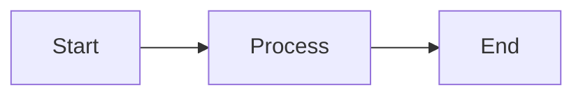

# Note Templates

This directory contains reusable templates for creating consistent notes across the knowledge base.

## Available Templates

| Template | Use Case | Location |
|----------|----------|----------|
| `technical-note.md` | Programming concepts, tools, technologies | `dev/`, `devops/` |
| `cloud-service.md` | AWS, Azure, GCP service documentation | `cloud/` |
| `blog-post.md` | Blog articles and tutorials | `blog/posts/` |
| `certification-study.md` | Certification exam prep notes | `learning/certifications/` |
| `project-doc.md` | Project documentation | `projects/` |
| `cheatsheet.md` | Quick reference guides | `cheatsheets/` |
| `ctf-writeup.md` | CTF challenge solutions | `security/ctf/` |

## How to Use

### 1. Copy the Template

```bash
# Example: Create a new Python note
cp docs/_templates/technical-note.md docs/dev/python/decorators.md
```

### 2. Update the Frontmatter

Every note should have proper YAML frontmatter:

```yaml
---
title: Your Note Title
date:
  created: 2024-01-15
  updated: 2024-01-15
tags:
  - relevant-tag
  - another-tag
---
```

### 3. Fill in the Content

Replace placeholder text with your actual content. Delete sections you don't need.

## Template Features

All templates support these MkDocs Material features:

### Admonitions (Callout Boxes)

```markdown
!!! note "Title"
    Content here

!!! tip "Pro Tip"
    Helpful advice

!!! warning "Caution"
    Warning message

!!! danger "Critical"
    Important warning
```

Available types: `note`, `abstract`, `info`, `tip`, `success`, `question`, `warning`, `failure`, `danger`, `bug`, `example`, `quote`

### Collapsible Sections

```markdown
??? note "Click to expand"
    Hidden content here

???+ note "Expanded by default"
    Visible content
```

### Code Blocks with Tabs

```markdown
=== "Python"

    ```python
    print("Hello")
    ```

=== "JavaScript"

    ```javascript
    console.log("Hello");
    ```
```

### Task Lists

```markdown
- [x] Completed task
- [ ] Pending task
```

### Diagrams (Mermaid)

````markdown

````

### Keyboard Keys

```markdown
Press ++ctrl+c++ to copy
```

## Naming Conventions

- Use lowercase with hyphens: `my-note-name.md`
- Be descriptive but concise
- Use `index.md` for section landing pages

## Tags

Use consistent tags across notes:

| Category | Tags |
|----------|------|
| Cloud | `aws`, `azure`, `gcp`, `cloud` |
| Development | `python`, `javascript`, `go`, `development` |
| DevOps | `docker`, `kubernetes`, `terraform`, `cicd` |
| Security | `pentesting`, `ctf`, `security` |
| Learning | `certification`, `course`, `book` |

## Contributing New Templates

When creating a new template:

1. Create the template in `docs/_templates/`
2. Include comprehensive YAML frontmatter
3. Add helpful placeholders and examples
4. Document it in this README
