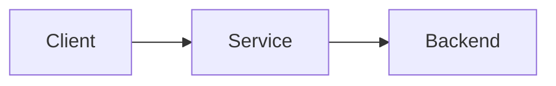

# [Service Name]

Brief description of the cloud service.

## Overview

| Attribute | Value |
|-----------|-------|
| **Provider** | AWS / Azure / GCP |
| **Category** | Compute / Storage / Database / etc. |
| **Pricing Model** | On-demand / Reserved / Spot |
| **Region Availability** | Global / Regional |

## Key Features

- Feature 1
- Feature 2
- Feature 3

## Use Cases

- [ ] Use case 1
- [ ] Use case 2
- [ ] Use case 3

## Architecture



## Getting Started

### Prerequisites

- AWS/Azure/GCP account
- CLI configured
- Required permissions

### Quick Start

```bash
# Create resource
aws/az/gcloud command create ...

# Configure
aws/az/gcloud command configure ...

# Verify
aws/az/gcloud command describe ...
```

## Configuration Options

### Basic Configuration

```yaml
# Configuration example
setting1: value1
setting2: value2
```

### Advanced Configuration

```yaml
# Advanced settings
advanced_setting: value
```

## CLI Commands

### Common Operations

```bash
# List resources
aws/az/gcloud command list

# Create
aws/az/gcloud command create --name NAME

# Delete
aws/az/gcloud command delete --name NAME

# Update
aws/az/gcloud command update --name NAME --setting VALUE
```

## Pricing

!!! info "Pricing Tiers"
    | Tier | Price | Features |
    |------|-------|----------|
    | Free | $0 | Limited resources |
    | Standard | $X/month | Full features |
    | Enterprise | Custom | Premium support |

## Security Considerations

!!! warning "Security Best Practices"
    - Enable encryption at rest
    - Use IAM roles (not keys)
    - Enable logging and monitoring
    - Implement least privilege access

## Monitoring

### Key Metrics

- Metric 1: What to monitor
- Metric 2: Thresholds to set
- Metric 3: Alerts to configure

### CloudWatch / Azure Monitor / Cloud Monitoring

```bash
# Example monitoring command
```

## Troubleshooting

??? question "Common Issue 1"
    **Symptom:** Description

    **Solution:** How to fix it

??? question "Common Issue 2"
    **Symptom:** Description

    **Solution:** How to fix it

## Related Services

- [Related Service 1](link)
- [Related Service 2](link)

## References

- [Official Documentation](url)
- [Best Practices Guide](url)
- [Pricing Page](url)
