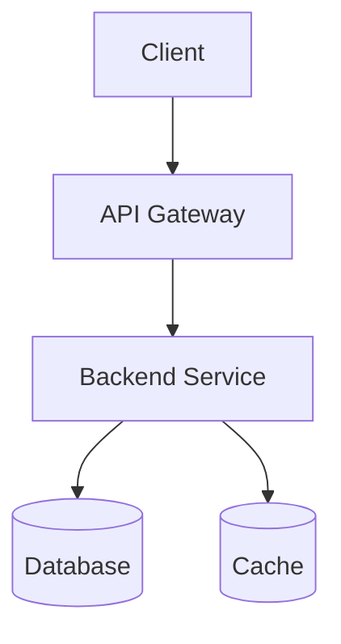

# [Project Name]

Brief one-line description of the project.

## Overview

| Attribute | Value |
|-----------|-------|
| **Status** | Planning / Active / Completed / Archived |
| **Started** | YYYY-MM-DD |
| **Completed** | YYYY-MM-DD |
| **Repository** | [GitHub](url) |
| **Live URL** | [Link](url) |

## Description

Detailed description of what the project does and why it exists.

## Goals

### Primary Goals

- [x] Goal 1 (completed)
- [ ] Goal 2 (in progress)
- [ ] Goal 3 (pending)

### Stretch Goals

- [ ] Nice-to-have feature 1
- [ ] Nice-to-have feature 2

## Tech Stack

| Layer | Technology |
|-------|------------|
| Frontend | React / Vue / etc. |
| Backend | Node.js / Python / etc. |
| Database | PostgreSQL / MongoDB / etc. |
| Infrastructure | AWS / GCP / etc. |
| CI/CD | GitHub Actions / etc. |

## Architecture

### System Overview



### Key Components

1. **Component 1:** Description and responsibility
2. **Component 2:** Description and responsibility
3. **Component 3:** Description and responsibility

## Setup

### Prerequisites

- Requirement 1
- Requirement 2
- Requirement 3

### Installation

```bash
# Clone repository
git clone <url>
cd project-name

# Install dependencies
npm install  # or equivalent

# Configure environment
cp .env.example .env
# Edit .env with your values

# Run development server
npm run dev
```

### Configuration

| Variable | Description | Default |
|----------|-------------|---------|
| `VAR_1` | Description | `value` |
| `VAR_2` | Description | `value` |

## Technical Decisions

### Decision 1: [What Was Decided]

**Context:** Why was this decision needed?

**Options Considered:**

1. Option A
   - Pros: ...
   - Cons: ...

2. Option B
   - Pros: ...
   - Cons: ...

**Decision:** What we chose and why.

**Consequences:** Impact of this decision.

---

### Decision 2: [What Was Decided]

**Context:** ...

**Decision:** ...

## Development Notes

### Conventions

- Naming conventions
- Code style
- Commit message format

### Testing

```bash
# Run tests
npm test

# Run with coverage
npm run test:coverage
```

### Deployment

```bash
# Deploy to staging
npm run deploy:staging

# Deploy to production
npm run deploy:prod
```

## Progress Log

### YYYY-MM-DD

- What was accomplished
- Challenges encountered
- Next steps

### YYYY-MM-DD

- ...

## Lessons Learned

### What Went Well

- Success 1
- Success 2

### What Didn't Go Well

- Challenge 1: How it was resolved or what we'd do differently
- Challenge 2: ...

### Key Learnings

- Learning 1
- Learning 2

## Future Improvements

- [ ] Improvement 1
- [ ] Improvement 2
- [ ] Improvement 3

## References

- [Reference 1](url)
- [Reference 2](url)
